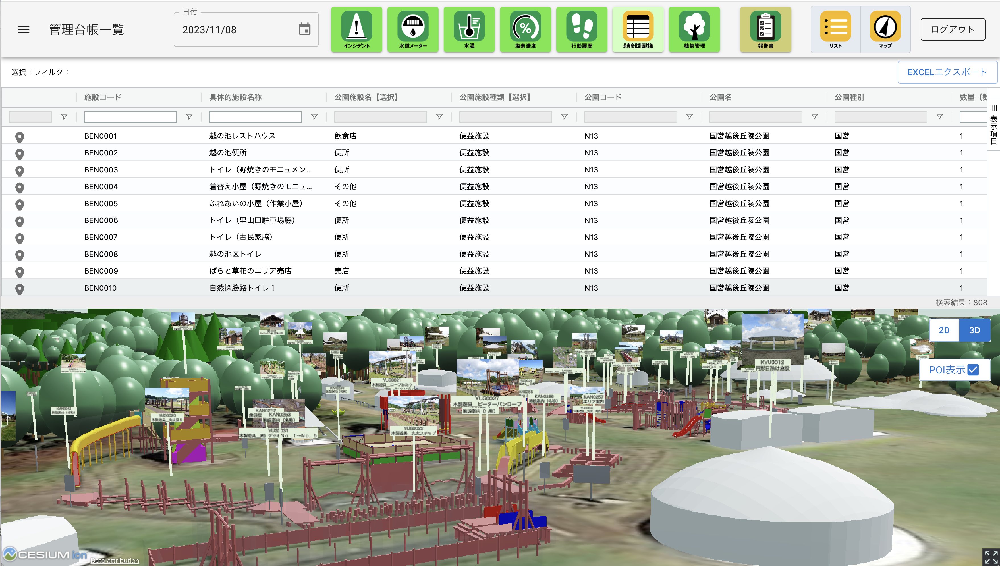

# 公園管理システムアプリケーション<!-- OSSの対象物の名称を記載ください。分かりやすさを重視し、できるだけ日本語で命名ください。英語名称の場合は日本語説明を（）書きで併記ください。 -->

 <!-- OSSの対象物のスクリーンショット（画面表示がない場合にはイメージ画像）を貼り付けください -->

## 1. 概要 <!-- 本リポジトリでOSS化しているソフトウェア・ライブラリについて1文で説明を記載ください -->
本リポジトリでは、Project PLATEAUの令和5年度のユースケース開発業務の一部であるUC23-21「まちづくりのDXの推進に向けたユースケース開発実証業務（公園管理DX 等）」について、その成果物である「公園管理システムアプリケーション」のソースコードを公開しています。

「公園管理システムアプリケーション」は、PLATEAUの3D都市モデルを活用して管理業務をDXし、効率的なインフラ管理の実現を目指すものです。

## 2. 「まちづくりのDXの推進に向けたユースケース開発実証業務（公園管理DX 等）」について <!-- 「」内にユースケース名称を記載ください。本文は以下のサンプルを参考に記載ください。URLはアクセンチュアにて設定しますので、サンプルそのままでOKです。 -->
「まちづくりのDXの推進に向けたユースケース開発実証業務（公園管理DX 等）」では、3D 都市モデルを活用した公園管理用のリレーショナルデータベースマネジメントシステム(RDBMS)を構築し、公園管理における管理者から現場担当者への方針伝達や点検記録、「公園施設長寿命化計画」に基づく方針立案や維持保全活動の情報共有に活用することを目的とした開発を行いました。
本システムは、RDBMS に紐づく管理用アプリケーション（OSS化対象外）と併せた利用を想定しており、施設の管理類型や健全度・緊急度判定等を把握しながら点検や計画立案・更新等の管理業務を効率化・高度化する機能の実装を行いました。
本システムの詳細については[技術検証レポート](https://www.mlit.go.jp/plateau/file/libraries/doc/plateau_tech_doc_0030_ver01.pdf)を参照してください。

## 3. 利用手順 <!-- 下記の通り、GitHub Pagesへリンクを記載ください。URLはアクセンチュアにて設定しますので、サンプルそのままでOKです。 -->
本システムの構築手順及び利用手順については[利用チュートリアル](https://r5-plateau-acn.github.io/SolarPotential/)を参照してください。

## 4. システム概要 <!-- OSS化対象のシステムが有する機能を記載ください。 -->
### 【データ表示】
#### ①インシデントデータの表示と確認　
- 巡回点検アプリ（携帯アプリ）で取得してデータベースに登録されている、公園の遊具や施設類の異常等の状況を表示します。
- 異常があった場合は、報告時刻、施設名、異常内容と対応内容等の情報と地図へのリンクを表示します。

#### ②水道メータデータの表示　
- 巡回点検アプリ（携帯アプリ）で取得してデータベースに登録されている、水道メータの点検時の値を表示します。

#### ③水温データの表示　
- 巡回点検アプリ（携帯アプリ）で取得してデータベースに登録されている、水温の点検時の値を表示します。

#### ④塩素濃度データの表示　
- 巡回点検アプリ（携帯アプリ）で取得してデータベースに登録されている、塩素濃度の点検時の値を表示します。

#### ⑤行動履歴データの表示　
- 巡回点検アプリ（携帯アプリ）で自動的に取得してデータベースに登録されている、巡視員の携帯電話のGPSデータから作成した行動履歴データを表示します。

#### ⑥公園施設長寿命化計画データの表示　
- 公園施設長寿命化計画データのリストと地図を表示します。
- リストの絞り込みと地図表示が連動、地図クリックとリスト表示が連動します。

#### ⑦樹木管理台帳データの表示　
- 樹木管理台帳データのリストと地図を表示します。
- リストの絞り込みと地図表示が連動、地図クリックとリスト表示が連動します。

#### ⑧報告書の生成と表示、エクスポート　
- 巡回報告書を自動生成します。
- 生成された報告書はExcel形式でダウンロードできます。

## 5. 利用技術

| 種別              | 名称   | バージョン | 内容 |
| ----------------- | --------|-------------|-----------------------------|
| オープンソースソフトウェア       | [Apache HTTP Server](https://httpd.apache.org/) | 2.4.58 | Webアプリで配信を行うためのWebサーバーソフトウェア |
|        | [PostGIS](https://github.com/postgis/postgis) | 3.4.1 | PostgreSQLで位置情報を扱うことを可能とする拡張機能 |
| オープンソースライブラリ       | [CesiumJS](https://github.com/CesiumGS/cesium) | 1.115 | 3Dビューワ上にデータを描画するためのライブラリ |
|        | [React.js](https://github.com/facebook/react/releases) | 18.2.0 | JavaScriptのフレームワーク内で機能するUIを構築するためのライブラリ |
| オープンソースRDBMS       | [PostgreSQL](https://github.com/postgres/postgres) | 16.2 | 各種配信するデータを格納するリレーショナルデータベース |
|  商用ソフトウェア       | [FME Form](https://safe.com/) | 2023.1 | ファイル変換などの処理およびその自動化を行う |
|        | [FME Flow](https://safe.com/) | - | FME Formで構築した処理フローをサーバーで実行する |
|        | [Cesium ion](https://cesium.com/platform/cesium-ion/) | - | 3Dデータの変換と配信のクラウドサービス |
|   商用ライブラリ      | [AG Grid](https://ag-grid.com/) | 31.1.1 | JavaScriptで集計、フィルタリング等を行うためのライブラリ |

## 6. 動作環境 <!-- 動作環境についての仕様を記載ください。 -->
| 項目               | 最小動作環境                                                                                                                                                                                                                                                                                                                                    | 推奨動作環境                   | 
| ------------------ | ----------------------------------------------------------------------------------------------------------------------------------------------------------------------------------------------------------------------------------------------------------------------------------------------------------------------------------------------- | ------------------------------ | 
| OS                 | Microsoft Windows 10 以上　または macOS 12 Monterey 以上                                                                                                                                                                                                                                                                                                                  |  同左 | 
| CPU                | Pentium 4 以上                                                                                                                                                                                                                                                                                                                               | 同左              | 
| メモリ             | 8GB以上                                                                                                                                                                                                                                                                                                                                         | 同左                        |                  | 

## 7. 本リポジトリのフォルダ構成 <!-- 本GitHub上のソースファイルの構成を記載ください。 -->
| フォルダ名               | 詳細               | 
| ------------- | ------------ | 
| manager  | データマネージャ                                                                                                                                                                                                                                                                                                                              | 
| resources/map  | geojson置き場                                                                                                                                                                                                                                                                                                                              | 
| views/root   | ページレンダリングコンポーネント                                                                                                                                                                                                                                                                                                                            | 
| App.css   | アプリ標準スタイル                                                                                                                                                                                                                                                                                                                              | 
| App.js  | アプリコンポーネント                                                                                                                                                                                                                                                                                                                              | 
| index.css  |  初期スタイル                                                                                                                                                                                                                                                                                                                             | 
| index.js  |  初期JS                                                                                                                                                                                                                                                                                                                             | 

## 8. ライセンス <!-- 変更せず、そのまま使うこと。 -->

- ソースコード及び関連ドキュメントの著作権は国土交通省に帰属します。
- 本ドキュメントは[Project PLATEAUのサイトポリシー](https://www.mlit.go.jp/plateau/site-policy/)（CCBY4.0及び政府標準利用規約2.0）に従い提供されています。

## 9. 注意事項 <!-- 変更せず、そのまま使うこと。 -->

- 本リポジトリは参考資料として提供しているものです。動作保証は行っていません。
- 本リポジトリについては予告なく変更又は削除をする可能性があります。
- 本リポジトリの利用により生じた損失及び損害等について、国土交通省はいかなる責任も負わないものとします。

## 10. 参考資料 <!-- 技術検証レポートのURLはアクセンチュアにて記載します。 -->
- 技術検証レポート: https://www.mlit.go.jp/plateau/file/libraries/doc/plateau_tech_doc_0030_ver01.pdf
- PLATEAU WebサイトのUse caseページ「カーボンニュートラル推進支援システム」: https://www.mlit.go.jp/plateau/use-case/uc22-013/
