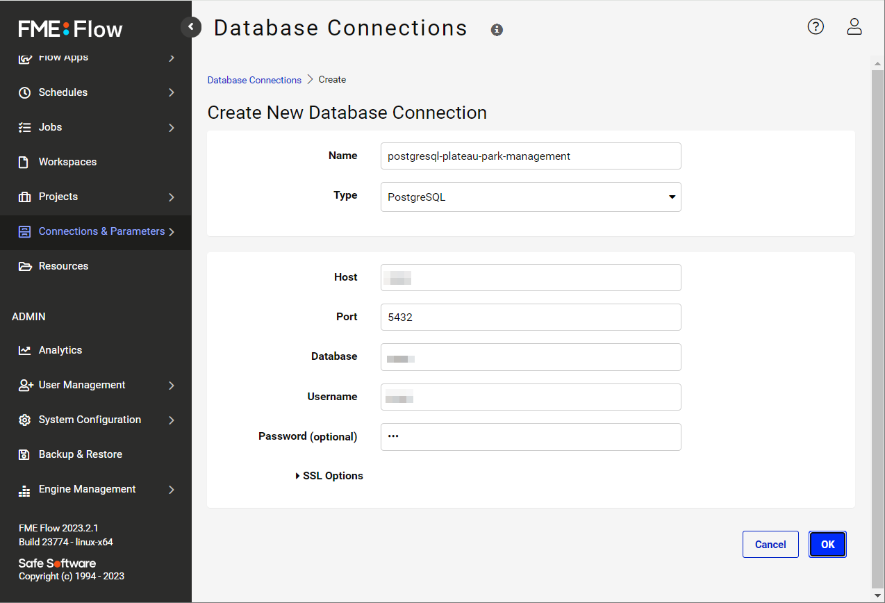
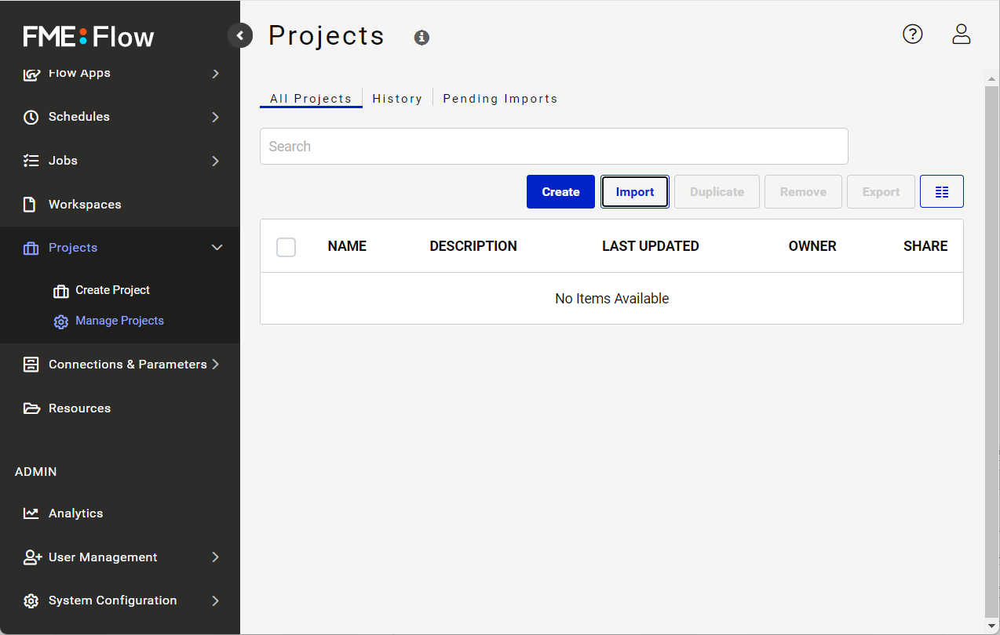
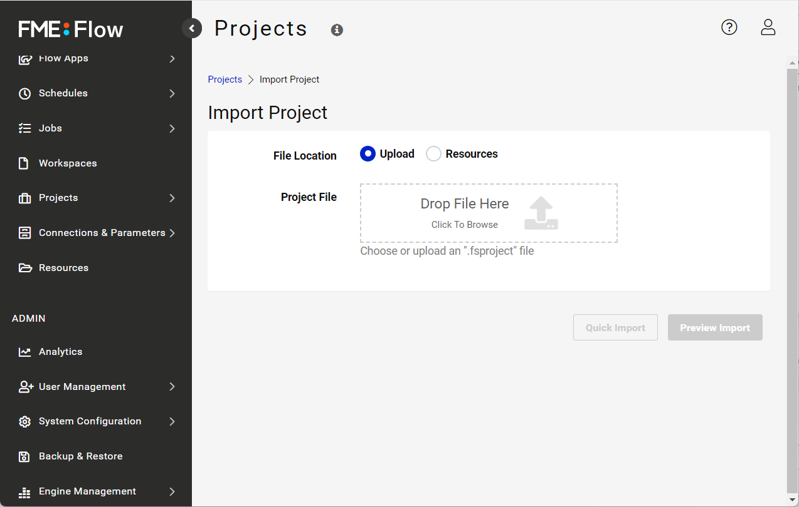

# 環境構築手順書

# 1 本書について

本書では、公園管理システムアプリケーション（以下「本システム」という。）の利用環境構築手順について記載しています。本システムの構成や仕様の詳細については以下も参考にしてください。

[技術検証レポート](https://www.mlit.go.jp/plateau/file/libraries/doc/plateau_tech_doc_0030_ver01.pdf)

# 2 動作環境

本変換ツールの動作環境は以下のとおりです。

| 項目               | 最小動作環境                                                                                                                                                                                                                                                                                                                                    | 推奨動作環境                   | 
| ------------------ | ----------------------------------------------------------------------------------------------------------------------------------------------------------------------------------------------------------------------------------------------------------------------------------------------------------------------------------------------- | ------------------------------ | 
| 仮想サーバー                 | Amazon EC2 t2.small 以上                                                                                                                                                                                                                                                                                                                  |  同左 | 
  
  公園施設CityGMLを本システムに投入するためのFMEワークスペースの実行環境は下記のとおりです。
  
| 項目               | 最小動作環境                                                                                                                                                                                                                                                                                                                                    | 推奨動作環境                   | 
| ------------------ | ----------------------------------------------------------------------------------------------------------------------------------------------------------------------------------------------------------------------------------------------------------------------------------------------------------------------------------------------- | ------------------------------ | 
| OS                 | Microsoft Windows 10 以上　または macOS 12 Monterey 以上                                                                                                                                                                                                                                                                                                                  |  同左 | 
| CPU                | Pentium 4 以上                                                                                                                                                                                                                                                                                                                               | 同左              | 
| メモリ             | 8GB以上                                                                                                                                                                                                                                                                                                                                         | 同左                        |                  | 
| ネットワーク       | 【変換・作成】 変換したデータ（3DTiles等）の格納先（AWS S3、PostgreSQL）にアクセスできる環境が必要                            | 

# 3 事前準備

本システムで利用する下記の商用、オープンソースのソフトウェアおよびデータベースを準備します。

（1）データベースの準備
[こちら](https://github.com/postgres/postgres)を利用してPostgreSQLサーバを起動します。その上で、位置情報を扱うための拡張機能である[PostGIS](https://github.com/postgis/postgis)をインストールします。

（2）ウェブサーバの準備
[こちら](https://httpd.apache.org/)を利用してウェブサーバを起動します。

（3）FME Flowの準備
[こちら](https://safe.com/)を利用してFME Flowを起動します。
尚、FME Flowは、商用のソフトウェアです。業務目的で利用するには、ライセンスの購入が必要です。新規ライセンスの購入については、Pacific Spatial Solutions 株式会社（Safe Software の公式パートナー）にお問い合わせください。
FME Flowの起動ができたら、以下の手順で本システムを稼働させるためのセットアップをしてください。

・データベースコネクションの設定
　（1）で準備したPostgreSQLへの接続情報をFME Flowのウェブインターフェースメニューの「Connections & Parameters」セクションで、下記の通り設定してください。
　
　
　次に本システム用の[FME Flowのプロジェクトファイル](https://github.com/Project-PLATEAU/Park-facility-management-system/blob/main/workspaces/plateau-park-management-placement-simulation-system1.0.0_2025-2-21-T190330_b24627.zip)(要ZIP回答）を以下の手順でFME Flowにインポートしてください。
　FME Flow ウェブインターフェースメニューの「Projects」セクションの「Manage Projects」で [Import] ボタンをクリックするとアップロードできます。

（4）Amazon S3の準備
[こちら](https://aws.amazon.com/jp/s3/)からAmazon S3のアカウントを取得し、本システムで使用するためのバケットを作成します。一つの公園を対象とする場合はstandardで十分ですが、ご利用になるデータサイズに応じたサイズのバケットを選択してください。

# 4 インストール手順
（1）ウェブサーバにコードを配置
[こちら](https://github.com/Project-PLATEAU/Park-facility-management-system/tree/main/admin-web/src)から公園管理アプリケーションのコードをダウンロードします。
施設配置シミュレーション機能を利用する場合は、[こちら](https://github.com/Project-PLATEAU/Park-facility-management-system/tree/main/relocation-web/src)からコードをダウンロードします。
展開したファイルを 3（2）で準備したウェブサーバのwebrootに配置します。

（2）環境変数の設定
下記の通り、環境変数を設定します。.envファイルとしてプロジェクトルートに配置してください。

`REACT_APP_API_ENDPOINT=<APIのURL>` 
`REACT_APP_MEDIA_ENDPOINT=<画像や音声の保存パス>` 
`REACT_APP_AG_GRID_LICENSE_KEY=<AG Gridのライセンスキー>` 
`REACT_APP_3DTILES_ENDPOINT=<3DTilesの保存パス>`

# 5 初期データの投入
本システムの稼働に必要なデータを投入します。

（1）初期データの登録：PostgreSQLへの格納
・公園施設CityGMLデータ
　[こちら](https://github.com/Project-PLATEAU/Park-facility-management-system/blob/main/workspaces/)のワークスペース（fn001）をFME Formで実行してください。実行の際にはPostgreSQLへの接続情報を求めるプロンプトが表示されますので、これに従って、入力してください。入力データはPLATEAUの3D都市モデル標準製品仕様書の規則に従ったCityGML形式のデータとします。 

・樹木台帳データ
　属性データの更新に

| フィールド名       | データ型  |
| ------------------ | -------- |
| 公園コード        | text     |
| 公園名          | text     |
| 公園種別        | text     |
| 施設コード        | text     |
| 公園施設種類      | text     |
| 公園施設名      | text     |
| 公園施設名（任意）| text     |
| 種名            | text     |
| 幹周            | numeric  |
| 樹高            | numeric  |
| 本数            | numeric  |
| 本数単位        | text     |
| 備考            | text     |
| 経度            | numeric  |
| 緯度            | numeric  |
| 標高            | numeric  |

（2）表示用データの登録：Amazon S3への格納
（1）でPostgreSQLに格納した公園施設CityGMLテーブルと公共測量成果の精度を満たさない地物を生成するためのデータ（Shapeファイル、OBJファイル、CSVファイル）を入力データとして、[こちら](https://github.com/Project-PLATEAU/Park-facility-management-system/blob/main/workspaces/fn002_可視化用データ変換処理.fmw)のワークスペースをFME Formで実行してください。実行の際には、以下の入力データの指定と。PostgreSQLおよびS3への接続情報をそれぞれプロンプトに従って入力してください。

