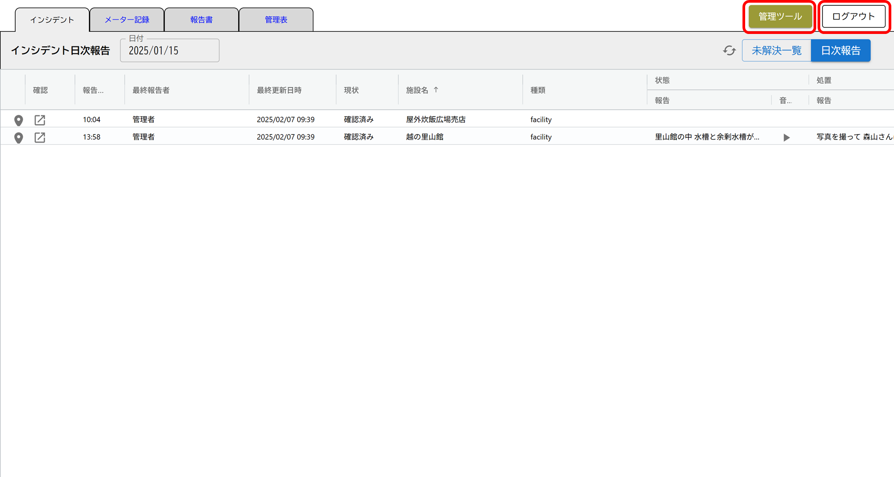
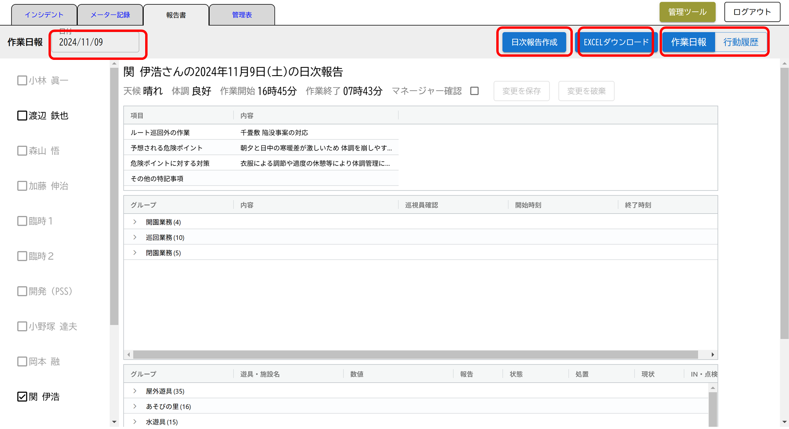
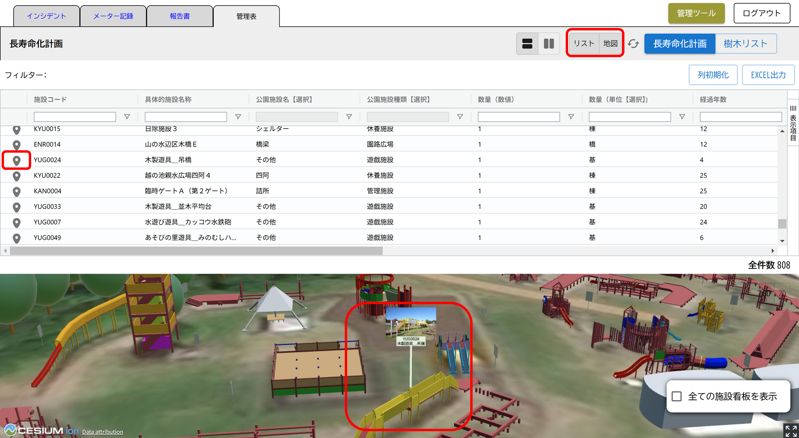
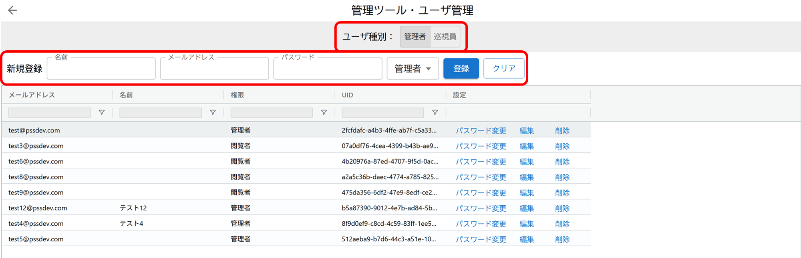

# 操作マニュアル

# 1 本書について

本書では、公園管理アプリおよび施設配置シミュレーション機能の操作手順について記載しています。

# 2 使い方（公園管理アプリ）
## 2-1 ログイン画面

公園管理アプリをデプロイしたURLにアクセスすると以下の画面が表示されます。設定したログインID（メールアドレス）、パスワードを入力することでシステムのトップ画面が表示されます。

## 2-2 メイン画面

ログインすると以下の画面が表示されます。タブでメニューを切り替えることができます

①　管理ツール

・ログインユーザーを登録・権限などのユーザー管理を行うことができます。

② ログアウト

・システムからログアウトします。

### 2-2-1 インシデントタブ

① 日付選択

・デフォルトでは最終更新を行ったインシデント一覧が表示されますが、任意の年月日を選択することができます。

② 日次報告

・点検アプリで入力した日次のインシデントを一覧表示します。

③ 未解決一覧

・点検アプリで入力した日次のインシデントのうち、対応が完了していないインシデントを一覧表示します。

④ インシデント確認

・点検アプリで入力したインシデントの詳細（テキスト、音声、画像）を確認することができます。

・ステータスの管理（対応済、対応要請、対応完了）を行うことができます。

・管理者（本管理画面）と巡視員（点検アプリ）間でテキストメッセージを送受信できます。

・地図ボタンで地図上で位置を確認できます。2D,3Dの切り替えも可能です。

### 2-2-2 メーター記録タブ

① 日付選択

　デフォルトでは点検アプリで入力された最終日付のメーター記録が表示されますが、任意の年月日を選択することができます。

② メータ、水温、水質

　点検アプリで入力した水道メータ、水温、水質の値と点検時刻を一覧表示することができます。

### 2-2-3 報告書タブ

① 報告書

　指定した日の巡視員の1日の業務報告をマネージャーが確認し、承認することができます。また、巡視員ごとのデータをエクセル形式で出力することもできます。点検アプリで取得された点検員の行動履歴（点検のために立ち寄った設備名と入退場時刻）を一覧表示することができます。

② 日次報告作成
　指定した日の巡視員の1日の業務内容をまとめ、日次報告書を作成します。

③ EXCELダウンロード
　日時報告の内容をExcelでダウンロードできます。

④ 行動履歴
　巡視員の1日の行動履歴（位置情報）を表示します。

### 2-2-4 管理表タブ

⑤ 管理表

　長寿命化計画対象の設備の属性」を一覧表示、検索、並べ替え、出力する他、連動して地図上に表示することができます。また長寿命化計画の対象となっていない「樹木リスト」を一覧表示、検索、並べ替え、出力する他、連動して地図上に一覧表示することができます。

① データの検索・絞り込み

・一覧画面で、列名（図中赤四角）を押下すると、その列の値に従って昇順、降順の並べ替えが行えます。また、フィルタボタン（図中赤丸印）を押下して、「含む」などの条件を選択し、基準となる値を入力することでデータの絞り込みが行えます。また各列の先頭にある入力ボックスに検索したい数値や文字列を入力すると、該当するレコードの絞り込みが行えます。

② データのエクスポート

・検索や絞り込みの結果を反映した状態でエクセルファイルとして出力することができます。⑦長寿命化計画対象、⑧植物管理は画面右上の「EXCELエクスポート」ボタンを、⑨の報告書は画面左下の「エクスポート」ボタンを押下することでデータのダウンロードが開始します。

⑥ リスト

・管理表を一覧表形式に切り替えることができます。なお、システムのデフォルトは一覧表示となっています。

⑦ 地図

・管理表の結果表示を地図に切り替えることができます。
・地図画面の右上には2Dと3Dの表示を切り替えるボタンがあります。表示したい方のボタンを押下すると画面が切り替わります。
・地図画面の2D /３D切り替えボタンの下に「POI表示」チェックボックスがあります。デフォルトではチェックが入っていませんが、チェックを入れると施設名称と名称がビルボードとして表示されます。

・一覧、地図を同時に表示した状態（⑩と⑪を両方押下した状態）では、施設コード（"BEN0002"など）の左にあるピンを押下した時、地図画面は選択した施設にズームインし、POIのビルボードが表示されます。

## 2-3 管理ツール画面

ログインユーザーを登録・権限などのユーザー管理を行うことができます。

①ユーザー登録

ユーザー種別（管理者または巡視員）を選択し、ユーザー登録を行います。

②ユーザー一覧

登録されているユーザー一覧が表示されます。ユーザー種別（管理者または巡視員）を選択し、表示を切り替えます。

# 3 使い方（施設配置シミュレーション）

公園管理アプリの施設配置シミュレーション機能をデプロイしたURLにアクセスすると以下の画面が表示されます。

## 3-1 施設配置画面

①配置する施設の選択

新たな場所に配置を行いたい施設・遊具をリストから選択します。施設IDや名称により、検索して対象リストを絞り込むことができます。

リスト上で、対象の施設・遊具とクリックすると、地図上で該当施設が表示されます。

右下の「移設開始」を押すと、移設先を指定する赤いカーソルが地図上に表示されます。

②移設

赤いカーソルを移設したい場所に動かします。右下の「ここに移設する」ボタンを押すと、移設データベースの更新が開始されます。

移設が完了すると、リストの左端の状況が「移設完了」に変わり、リスト上で対象の施設をクリックすると地図上に表示されます。

③削除

削除したい施設・遊具をリスト上でクリックします。画面右下に表示される「施設を除去」ボタンを押すと、移設データベースから削除されます。